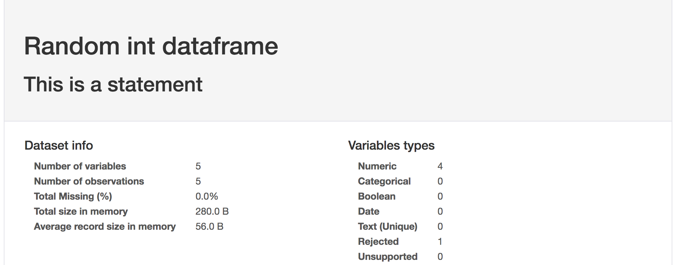

# pandas-profiling addon  


Adds the feature of short descriptive texts to the html-output of pandas-profiling  

* **dataframe_name**:  short name for dataframe content
* **statement**: description for dataframe (like where the data is from, sql statement etc.)

```python
import pandas as pd
import numpy as np
import pandas_profiling as pp

df2 = pd.DataFrame(np.random.randint(low=0, high=10, size=(5, 5)),
        columns=['a', 'b', 'c', 'd', 'e'])

# for output as file
profile = pp.ProfileReport(df2, dataframe_name='Random int dataframe', statement='This is a statement')
profile.to_file(outputfile=  "RandomInt.html")

# or inline
pp.ProfileReport(df2, dataframe_name='Random int dataframe', statement='This is a statement')


```


## Features in HTML Output

### dataframe_name and statement in generated HTML-Output




### dataframe_name as tab text in browser

